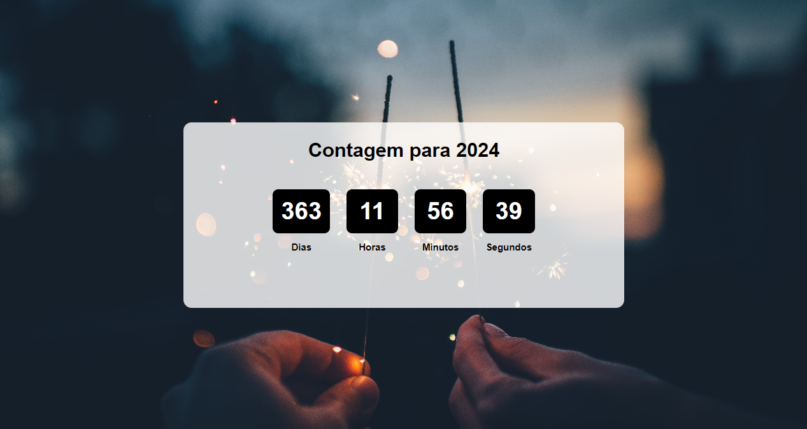

<h1 align="center"> Countdown com React.js</h1>

Desafio 04 - Frontend Mentor

  <a href="#-tecnologias">Tecnologias</a>&nbsp;&nbsp;&nbsp;|&nbsp;&nbsp;&nbsp;
  <a href="#-projeto">Objetivos e Desafios </a>&nbsp;&nbsp;&nbsp;|&nbsp;&nbsp;&nbsp;
  <a href="#-projeto">Projeto</a>&nbsp;&nbsp;&nbsp;|&nbsp;&nbsp;&nbsp;

 

 
  
  
  

## 🚀 Tecnologias

Esse projeto foi desenvolvido com as seguintes tecnologias:

- HTML
- CSS
- JavaScript
- React.js
- Vite

## 🎯 Objetivos e Desafios 
Projeto desenvolvido para exercitar habilidades de React.js utilizando a biblioteca Vite. 

## 💻 Projeto

O projeto é um countdown para alguma data específica já programada previamente.

